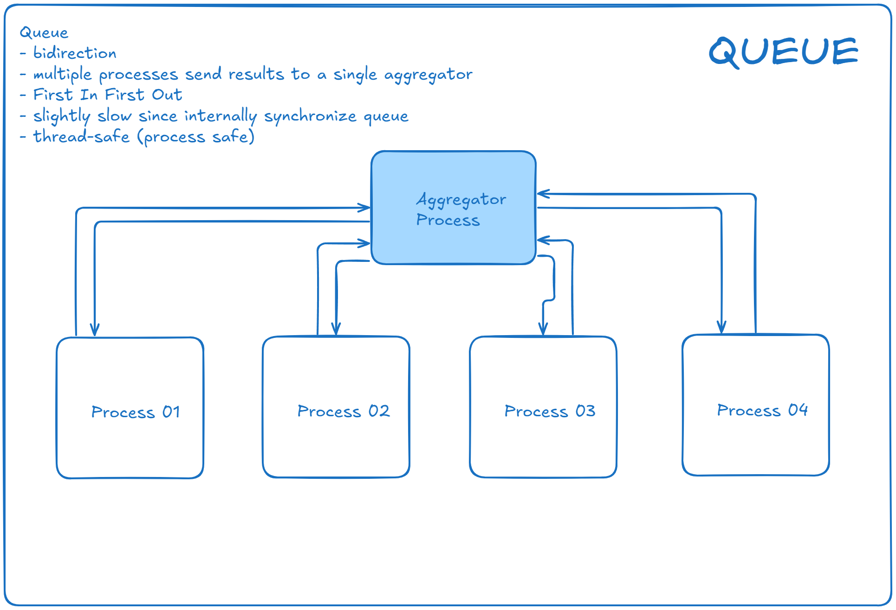
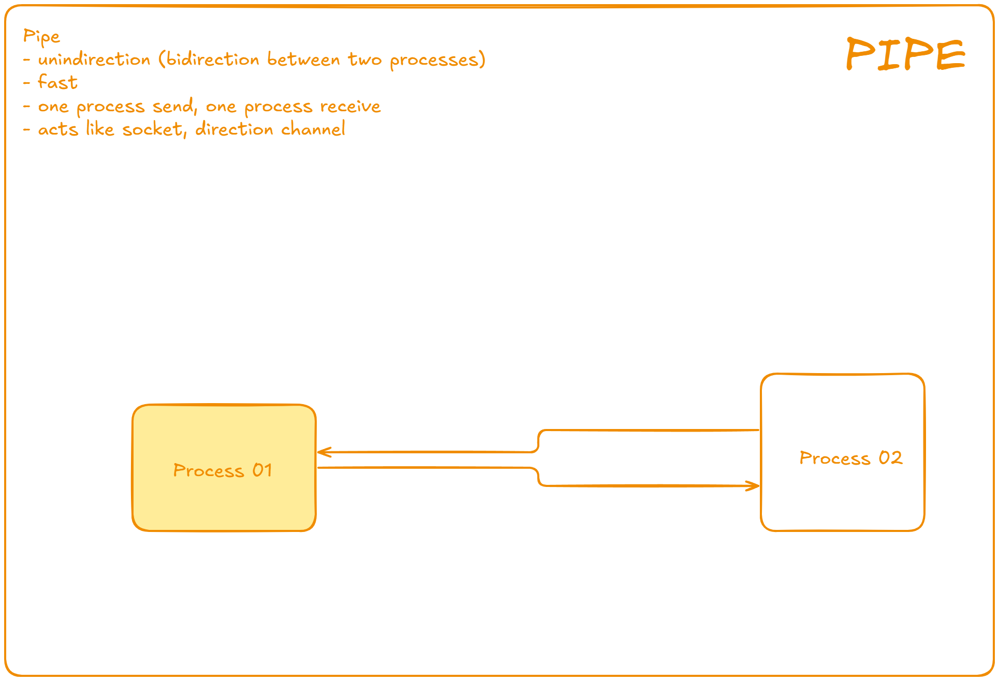

# Multiprocessing

## Theory

### What is multiprocessing?

- Multiprocessing refers to the ability of a system to support more than one processor at the same time. Application in a multiprocessing system are broken to smaller routines that run independently. The operating system allocates these threads to the processors improving performance of the system.

### Why multiprocessing?

- Consider a computer system with a single processor. If it is assigned several processes at the same time, it will have to interrupt each task and switch briefly to another, to keep all the processes going. This situation is just like a chef workin in a kitchen alone. He has to do several tasks like baking, stirring kneading dough, etc. So the gist is that: The more tasks you must do at once, the more difficult it gets to keep track of them all, and keeping the timing right becomes more of a challenge. This is where the concept of mutiprocessing arise!


### A multiprocessing system can have

1. multiprocessor: ie a computer with more than one CPU (some server computer support more than one CPU such dual Xeon CPU)
2. multi-core processor: ie a single computing component with two or more independant actual processing units (called cores, a Xeon CPU can have 28 to 36 cores per CPU)

Here the CPU can easily executes several tasks at once, with each task using it own processor. It is just like the chef in last situation being assisted by his assistants. Now, they can divide the tasks among themself and chef doesn't need to switch between his tasks.


## Example

### Multiprocessing in Python

In Python the [mutiprocessing](https://docs.python.org/3/library/multiprocessing.html) module includes a very simple and intuitive API for dividing work between multiple processes. Let us consider a simple example using `multiprocessing` module.

#### Example 01

```python
import multiprocessing
import time


def print_cube(num: float) -> None:
    """
    function to print cube of given num

    Parameters:
    - num: float

    Returns:
    - None
    """

    print("Simulate some work for cube")
    time.sleep(10)
    print(f"Cube: {num * num * num}")


def print_square(num: float) -> None:
    """
    function to print square of given num

    Parameters:
    - num: float

    Returns:
    - None
    """

    print("Simulate some work for square")
    time.sleep(15)
    print(f"Square: {num * num}")


if __name__ == "__main__":
    # creating processes
    p1 = multiprocessing.Process(target=print_square, args=(10,))
    p2 = multiprocessing.Process(target=print_cube, args=(13,))

    # starting process 1
    p1.start()

    # starting process 2
    p2.start()

    # wait until process 1 is finished
    p1.join()

    # wait until process 2 is finished
    p2.join()

    # both processes finished
    print("Done")

# Result
#
# Simulate some work for cube
# Simulate some work for square
# Cube: 2197
# Square: 100
# Done
```

Explain the example from above:

* To import the `multiprocessing` module, do: `import multiprocessing`
* To create a process, we create an object of Process class, it take following arguments:
  * target: the function to be executed by process
  * args: the arguments to be passed to the target function, we passing a tuple of parameters
  ```python
  p1 = multiprocessing.Process(target=method_name_01, args=(param1, param2))
  p2 = multiprocessing.Process(target=method_name_02, args=(param1,))
  ```
* to start a process, we use `start` method of `Process` class: `p1.start()`
* once the processes start, the current program also keeps on executing, in order to stop execution of current program until a process is complete, we use `join` method
  ```python
  p1.join()
  p2.join()
  ```

#### Example 02

Consider another program to understand the concept of different processes running on the same Python script. In this example, we print the ID of the processes running the target function

```python
import multiprocessing
import time
import os


def worker01() -> None:
    print(f"Simulate some work for worker01. {os.getpid()}")
    time.sleep(10)
    print("Done worker01")


def worker02() -> None:
    print(f"Simulate some work for worker02. {os.getpid()}")
    time.sleep(10)
    print("Done worker02")


if __name__ == "__main__":

    print(f"ID of main process: {os.getpid()}")

    # creating processes
    p1 = multiprocessing.Process(target=worker01)
    p2 = multiprocessing.Process(target=worker02)

    # starting process 1
    p1.start()

    # starting process 2
    p2.start()

    print(f"ID of process p1: {p1.pid}")
    print(f"ID of process p2: {p2.pid}")

    print(f"Process p1 alive: {p1.is_alive()}")
    print(f"Process p2 alive: {p2.is_alive()}")

    # wait until process 1 is finished
    p1.join()

    # wait until process 2 is finished
    p2.join()

    # both processes finished
    print("Done")

    # check processes are alive
    print(f"Process p1 alive: {p1.is_alive()}")
    print(f"Process p2 alive: {p2.is_alive()}")

# Result
#
# ID of main process: 25392
# ID of process p1: 17192
# ID of process p2: 24004
# Process p1 alive: True
# Process p2 alive: True
# Simulate some work for worker01. 17192
# Simulate some work for worker02. 24004
# Done worker01
# Done worker02
# Done
# Process p1 alive: False
# Process p2 alive: False
```

* The main Python script has a different process ID and multiprocessing module spawns new processes with different process IDs as we create **Process** object **p1**, **p2**. In above program, we use **os.getpid()** function to get ID of process running the current target function. Notice that it matches with the process IDs p1, p2 which we using pid attribute of Process class.
* Each process runs independently and has its own memory space
* As soon as the execution of target function is finished, the processes get terminated. In above program we used `is_alive()` method of **Process** class to check if a process is still active or not.

Consider the diagram below to understand how new processes are different from main Python script


## The 4 Essential Parts of Multiprocessing in Python

Multiprocessing in Python involes several key components that allow efficient parallel execution of tasks:

* **Process**: The Process class is used to create and manage independent processes. Each process runs in its own memory space
* **Queue**: The Queue class is a shared job queue that allows process-safe data exchange and coordination between processes. It's used for passing messages or results between process instances.
* **Pipe**: Pipes provide a way to establish a communication channel between processes. They are useful for bidirectional communication between two processes.
* **Lock**: Locks are used to ensure that only process is executing a certain section of code at a time. This prevents data corruption by synchronizing access to shared resources.


Example 03

```python
from multiprocessing import Lock, Pipe, Queue, Process
from multiprocessing.connection import PipeConnection
from multiprocessing.synchronize import Lock as LockType
from typing import Any


def queue_worker(queue: "Queue[str]", lock: LockType):
    with lock:
        print("Task executed")
        queue.put("Done")


def pipe_worker(conn: PipeConnection):
    conn.send("Data from pipe worker")
    conn.close()


def consumer(queue: "Queue[Any]", parent_conn: PipeConnection, lock: LockType):
    with lock:
        print(f"Consumer received from queue: {queue.get()}")
        print(f"Consumer received from pipe: {parent_conn.recv()}")


if __name__ == "__main__":
    """
    Example that emphasize 4 essential key components of multiprocessing
    * Process
    * Queue
    * Pipe
    * Lock
    """
    # for exchange data between processes safely
    queue: "Queue[Any]" = Queue()

    # For synchronization (ensures only one process can access at a time)
    lock: LockType = Lock()

    # Pipe for two-way communications between processes
    parent_conn, child_conn = Pipe()

    # create separate processes

    # queue base process
    queue_process = Process(target=queue_worker, args=(queue, lock))
    # pipe base process
    pipe_process = Process(target=pipe_worker, args=(child_conn,))
    # consumer that receive data
    consumer_process = Process(target=consumer, args=(queue, parent_conn, lock))

    # start processes
    queue_process.start()
    pipe_process.start()

    # wait for both processes to finish
    queue_process.join()
    pipe_process.join()

    # start the consumer process after data is available
    consumer_process.start()
    consumer_process.join()

    print("Done")

# Result
#
# Task executed
# Consumer received from queue: Done
# Consumer received from pipe: Data from pipe worker
# Done
```

Example 04

```python
from multiprocessing import Queue, Pipe, Process, Lock
from multiprocessing.connection import PipeConnection
from multiprocessing.synchronize import Lock as LockType
import time
import random
from typing import List, Tuple


def scrape_website(
    url: str,
    queue: "Queue[Tuple[str, str]]",
    child_conn: PipeConnection,
    lock: LockType,
):
    print(f"Scraping {url}")
    scrape_time = random.randint(1, 10)
    time.sleep(scrape_time)
    data = f"Scraped data in {scrape_time} seconds"
    # Using lock to ensure only one process write data to share resource
    with lock:
        print(f"Scraped {url}")

    # send data to the main process
    queue.put((url, data))

    # send metadata via Pipe
    child_conn.send((url, data))
    child_conn.close()


def aggregate_data(
    queue: "Queue[Tuple[str, str]]",
    parent_conn: PipeConnection,
    lock: LockType,
    websites: List[str],
) -> None:
    results = []
    times = []

    for url in websites:
        web, data = queue.get()
        results.append((web, data))

        web_url, scrape_time = parent_conn.recv()
        times.append((web_url, scrape_time))

    # safely print the aggregate data using Lock
    with lock:
        print("---Aggregated result---")
        for url, data in results:
            print(f"{url}: {data}")

        for url, scrape_time in times:
            print(f"{url}: {scrape_time} seconds")


if __name__ == "__main__":
    websites = ["google.com", "facebook.com", "x.com", "github.com"]

    queue: "Queue[Tuple[str, str]]" = Queue()
    parent_conn, child_conn = Pipe()
    lock = Lock()

    processes = []

    for url in websites:
        p = Process(target=scrape_website, args=(url, queue, child_conn, lock))
        processes.append(p)
        p.start()

    # wait for all processes to finish
    for p in processes:
        p.join()

    aggregate_process = Process(
        target=aggregate_data, args=(queue, parent_conn, lock, websites)
    )
    aggregate_process.start()
    aggregate_process.join()
    print("Done")

# Result
#
# Scraping google.com
# Scraping facebook.com
# Scraping x.com
# Scraping github.com
# Scraped facebook.com
# Scraped x.com
# Scraped google.com
# Scraped github.com
# ---Aggregated result---
# facebook.com: Scraped data in 2 seconds
# x.com: Scraped data in 5 seconds
# google.com: Scraped data in 9 seconds
# github.com: Scraped data in 10 seconds
# facebook.com: Scraped data in 2 seconds seconds
# x.com: Scraped data in 5 seconds seconds
# google.com: Scraped data in 9 seconds seconds
# github.com: Scraped data in 10 seconds seconds
# Done 
```


## Advance section

Multiprocessing support two types of communication channel between processes:

* Queue: share data between multiple processes (slightly slow, multiple workers sending results to a single aggregator)
* Pipe: share data between two processes only (fast, one process send data and another process receive)

### Queue

A simple way to communicate between processes, pass messages back and forth between many processes. Any Python object can pass through a Queue.

Queue acts like FIFO (First In First Out), it useful when multiple processes need to share data. The mechanism is bidirection (multiple producers, multiple consumers).

Queue is slow since it need to synchronize data internally to ensure any process can access.

You don't need **Lock** with **Queue** since Queue is thread-safe (process safe). It mean Queue implement internal locking mechanism to manage concurrent access by multiple processes. So Queue automatically ensure **only one** process read from or write to queue at a time.

You only need **Lock** when dealing with **shared resources** like modify shared variables, write the same file, printing to console (something that not inheritantly thread-safe)



Example 01: without `Lock`

```python
from multiprocessing import Queue, Process
from typing import List

"""
Queue example without Lock since it is thread-safe
"""

def square_list(mylist: List[int], queue: "Queue[int]"):
    for item in mylist:
        # put data type int to queue
        queue.put(item**2)


def print_queue(queue: "Queue[int]"):
    while not queue.empty():
        print(queue.get())
    print("Queue is now empty")


if __name__ == "__main__":
    queue: "Queue[int]" = Queue()
    myList = [1, 4, 5, 6, 7, 4]
    p1 = Process(target=square_list, args=(myList, queue))
    p2 = Process(target=print_queue, args=(queue,))

    # running process p1 to square the list
    p1.start()
    p1.join()

    # running process p2 to get queue elements to print
    p2.start()
    p2.join()

    print("All Done")

# Result
#
# 1
# 16
# 25
# 36
# 49
# 16
# Queue is now empty
# All Done
```

Example 02: with `Lock`

```python
from multiprocessing import Process, Queue, Lock
from multiprocessing.synchronize import Lock as LockType
import time
from random import randint


# Worker function that sends data to the Queue
def worker_with_queue(queue: "Queue[int]", lock: LockType) -> None:
    result = randint(1, 100)  # Simulate some work by generating a random number
    time.sleep(randint(1, 3))  # Simulate task duration
    queue.put(result)  # Send the result to the shared Queue

    # Protect console output with Lock
    with lock:
        print(f"Worker {result} sent data to the queue.")


# Aggregator function that collects results from the Queue
def aggregator_with_queue(
    queue: "Queue[int]", lock: LockType, num_workers: int
) -> None:
    results = []
    for _ in range(num_workers):
        result = queue.get()  # Collect results from the Queue
        results.append(result)

        # Protect console output with Lock
        with lock:
            print(f"Aggregator received {result} from the queue.")
    print("Final aggregated results from Queue:", results)


if __name__ == "__main__":
    queue: "Queue[int]" = Queue()  # Queue is process-safe, no Lock needed
    lock = Lock()  # Lock for protecting console output
    num_workers = 3
    processes = [
        Process(target=worker_with_queue, args=(queue, lock))
        for _ in range(num_workers)
    ]

    # Start all worker processes
    for p in processes:
        p.start()

    # Start the aggregator to collect results
    aggregator = Process(target=aggregator_with_queue, args=(queue, lock, num_workers))
    aggregator.start()

    # Wait for all processes to finish
    for p in processes:
        p.join()
    aggregator.join()

# Result
#
# Worker 38 sent data to the queue.
# Aggregator received 38 from the queue.
# Worker 38 sent data to the queue.
# Aggregator received 38 from the queue.
# Worker 77 sent data to the queue.
# Aggregator received 77 from the queue.
# Final aggregated results from Queue: [38, 38, 77]
```

### Pipe

A pipe can have only two endpoints. Hence it is preffered over Queue when only two-way communication is required.

Pipe acts like socket or direct channel between TWO processes. Useful when two process need to communicate directly, usually unindirectional but can be bidirection with two connections.

Pipe is fast since it just communicate between TWO processes.



```python
```
